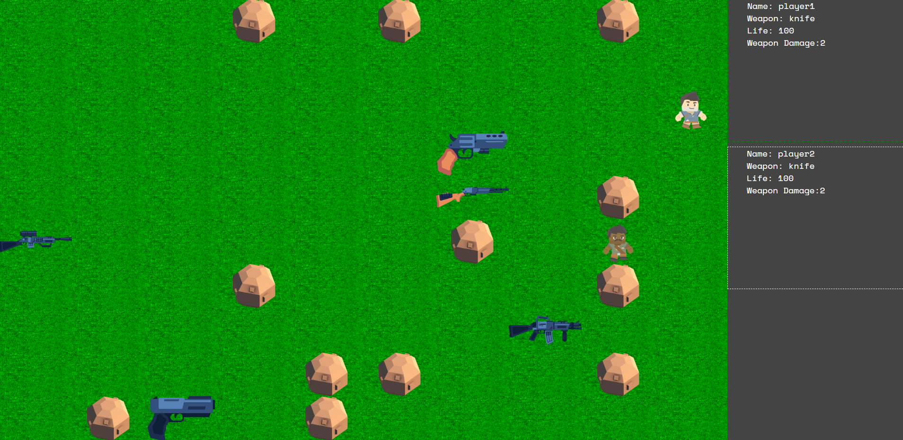
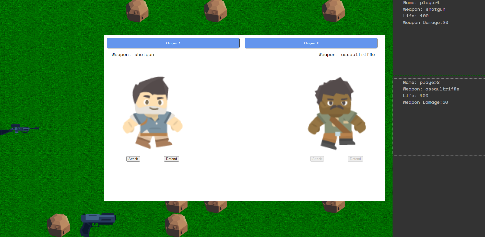
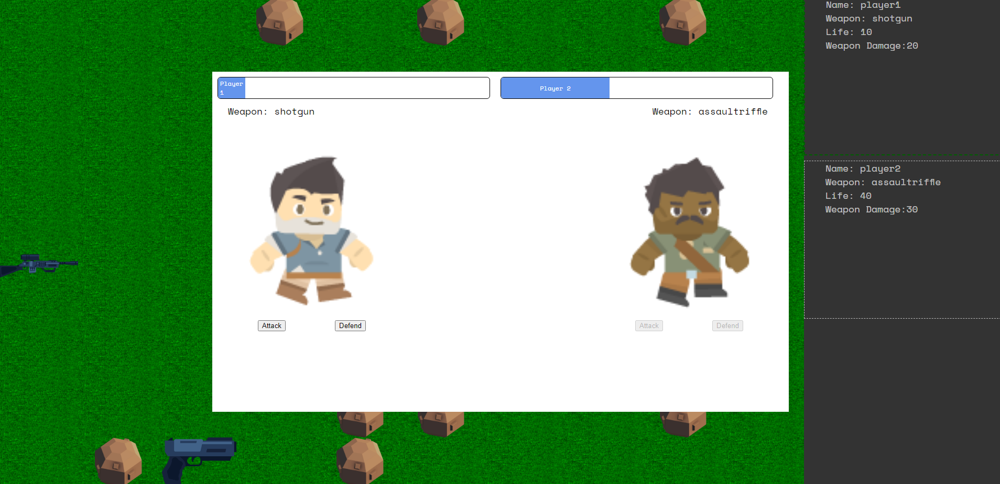
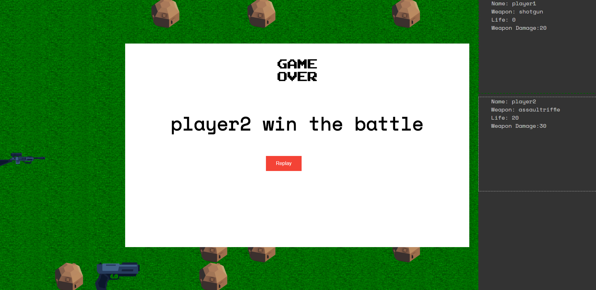

# board-game-in-JavaScript

In this project, you will create an online game written JavaScript in which 2 players play each turn to compete.

This project is my 6th project in the Front-End Developer path on [Open Classroom](https://openclassrooms.com/)

## Tech Stack

- HTML5
- CSS 3
- Vanilla Javascript

## Ressources

All my ressources are free images powered by [OpenGameArt.org](https://opengameart.org/). I want to thanks this community for that.

## Game Starter

## Battle Mode On

## Final Result of the battle

